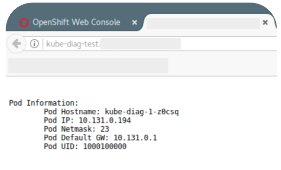

# Docker Container for Kubernetes and Openshift SDN Testing, Diagnostics & Troubleshooting

The Images is based on Centos7 with some troubleshooting tools installed;
* nmap
* ping
* curl
* wget
* telnet
* kubectl 
* oc client 
* openresty server (nginx with lua binary) 

to use:

`docker pull okansahiner/kube-diag`

or

`docker run -it -p 8080:8080 okansahiner/kube-diag:latest`

```
root@lxoscp01 ~]# oc rsh kube-diag-1-z0csq                                                                            
sh-4.2$ nmap jenkins.cicd.svc.cluster.local

Starting Nmap 6.40 ( http://nmap.org ) at 2017-07-21 09:04 UTC
Nmap scan report for jenkins.cicd.svc.cluster.local (172.30.108.143)
Host is up (0.0011s latency).
Not shown: 999 filtered ports
PORT   STATE SERVICE
80/tcp open  http

Nmap done: 1 IP address (1 host up) scanned in 5.39 seconds
sh-4.2$
```



